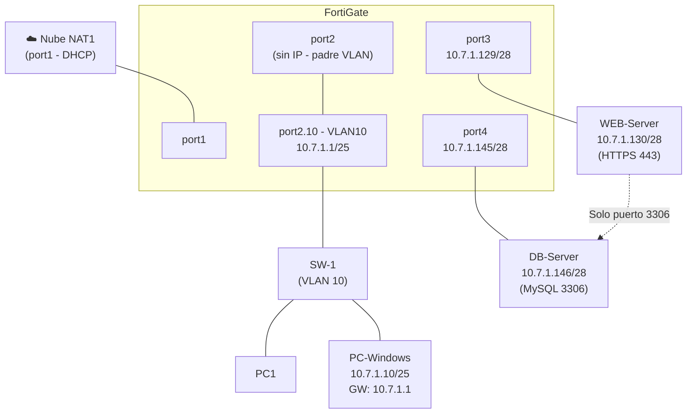
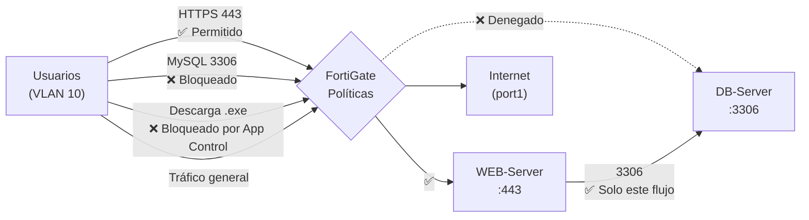
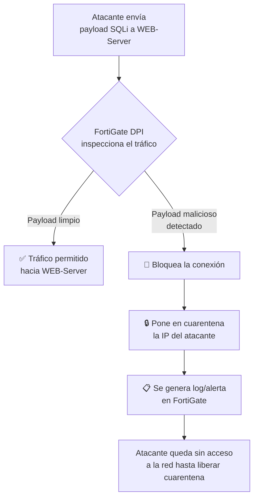

# Diagramas — Práctica FortiGate

## 1. Topología de red

```mermaid
flowchart TB
    NAT["☁️ Nube NAT1<br/>(port1 - DHCP)"]

    subgraph FGT["FortiGate"]
        P1["port1"]
        P2["port2<br/>(sin IP - padre VLAN)"]
        P210["port2.10 - VLAN10<br/>10.7.1.1/25"]
        P3["port3<br/>10.7.1.129/28"]
        P4["port4<br/>10.7.1.145/28"]
    end

    SW["SW-1<br/>(VLAN 10)"]
    PC1["PC1"]
    PCW["PC-Windows<br/>10.7.1.10/25<br/>GW: 10.7.1.1"]
    WEB["WEB-Server<br/>10.7.1.130/28<br/>(HTTPS 443)"]
    DB["DB-Server<br/>10.7.1.146/28<br/>(MySQL 3306)"]

    NAT --- P1
    P2 --- P210
    P210 --- SW
    SW --- PC1
    SW --- PCW
    P3 --- WEB
    P4 --- DB

    WEB -.->|"Solo puerto 3306"| DB
```

## 2. Flujo de políticas de tráfico

```mermaid
flowchart LR
    U["Usuarios<br/>(VLAN 10)"]
    FGT{"FortiGate<br/>Políticas"}
    WEB["WEB-Server<br/>:443"]
    DB["DB-Server<br/>:3306"]
    INT["Internet<br/>(port1)"]

    U -->|"HTTPS 443<br/>✅ Permitido"| FGT
    FGT -->|"✅"| WEB
    U -->|"MySQL 3306<br/>❌ Bloqueado"| FGT
    FGT -.->|"❌ Denegado"| DB
    WEB -->|"3306<br/>✅ Solo este flujo"| DB
    U -->|"Descarga .exe<br/>❌ Bloqueado por App Control"| FGT
    U -->|"Tráfico general"| FGT
    FGT --> INT
```

## 3. Detección y cuarentena anti SQL Injection (DPI)

```mermaid
flowchart TD
    A["Atacante envía<br/>payload SQLi a WEB-Server"] --> B{"FortiGate DPI<br/>inspecciona el tráfico"}
    B -->|"Payload limpio"| C["✅ Tráfico permitido<br/>hacia WEB-Server"]
    B -->|"Payload malicioso<br/>detectado"| D["🚫 Bloquea la conexión"]
    D --> E["🔒 Pone en cuarentena<br/>la IP del atacante"]
    E --> F["📋 Se genera log/alerta<br/>en FortiGate"]
    F --> G["Atacante queda sin acceso<br/>a la red hasta liberar cuarentena"]
```
